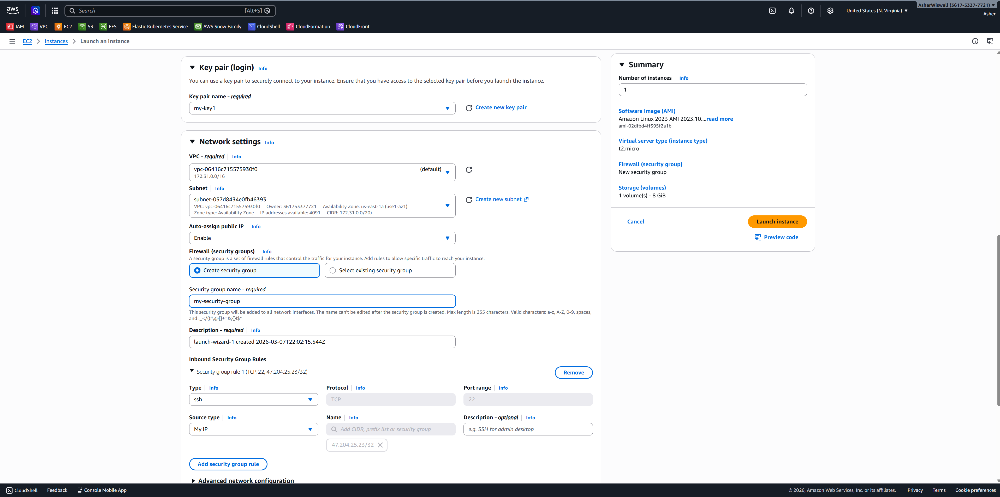

# aws-ec2-project

## Project Title

Deploying and Securing an AWS EC2 Instance

## Objective

This project demonstrates how to deploy a Linux EC2 instance in AWS, configure networking and security, and securely connect using SSH.

## Architecture Overview

- Amazon EC2
- Security Group
- Key Pair
- Amazon VPC

## Deployment Steps

### 1. Launched EC2 Instance

- AMI: Amazon Linux 2023
- Instance type: t2.micro
- Region: us-east-1
- Key pair created for secure login

### 2. Configured Security Group

- Allowed SSH port 22
- Restricted access to my public IP only
- All other inbound traffic denied

### 3. Connected via SSH

### 4. Verified Monitoring

- Confirmed instance metrics in CloudWatch
- Checked CPU utilization

## Screenshots

![EC2 Creation 2][creating-ec2-2.png]
![Key Pair Creation][creating-key-pair.png]
![EC2 Running][ec2-running.png]
![EC2 Metrics][ec2-metrics.png]
![SSH Connection][ssh-connection.png]

